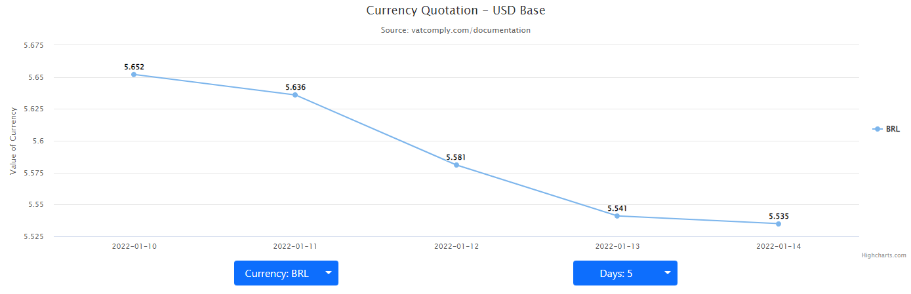

# Quotation Front

> This is a front end application to display changes in quotes. For this, React's Highcharts library was used. The project was developed using TypeScript.

## Screenshots

<p align='center'>
    
</p>

## Available Scripts

In the project directory, you can run:

### `npm start`

Runs the app in the development mode.\
Open [http://localhost:3000](http://localhost:3000) to view it in the browser.

The page will reload if you make edits.\
You will also see any lint errors in the console.

### `npm test`

Launches the test runner in the interactive watch mode.\
See the section about [running tests](https://facebook.github.io/create-react-app/docs/running-tests) for more information.

### `npm run build`

Builds the app for production to the `build` folder.\
It correctly bundles React in production mode and optimizes the build for the best performance.

The build is minified and the filenames include the hashes.\
Your app is ready to be deployed!

### Docker image

You can pull the Docker image for local testing with the command:

```sh
$ docker pull davisegundo88/front_quotation_container:main
```

Or you can use the Dockerfile to perform the local build:

```sh
$ docker build -f Dockerfile -t davisegundo88/quotation_front .
```

## Authors

Davi Segundo Pinheiro – davisp2009@hotmail.com

You can find me here at: 
Github - [Davi S.P](https://github.com/DaviSegundo)
LinkedIn - [Davi Segundo](https://www.linkedin.com/in/davi-segundo-881401210/)